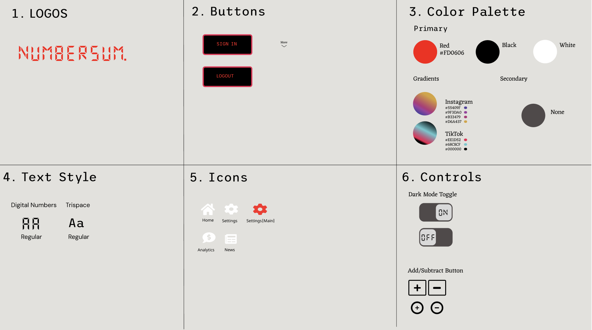

# numbersum-webapp

# Numbersum 

Numbersum is a clean, intelligent, and modern application designed to make working with social media numbers intuitive and insightful.

## style guide (Version 1)

## stack

### Frontend 

- Next.js (React Framework) — SEO friendly, API routes for backend integration
- Tailwind CSS / ShadCN UI — for clean, responsive UI
- Recharts / Chart.js — for analytics graphs

### Backend 

- Node.js / Express (or Next.js API routes)
- PostgreSQL or MongoDB for storing analytics data
-  Prisma ORM for database modeling
